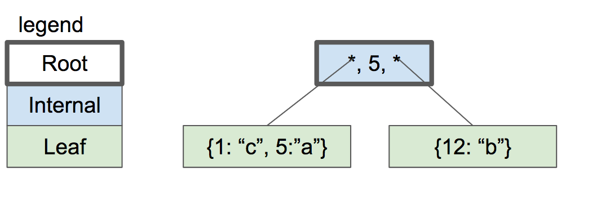

# Part2

这章代入 Cursor。

增加 Cursor struct，用于在 select、insert 时记录上下文。

以及翻译 B+ tree。

## Cursor

增加 struct Cursor, 作用于记录上下文 table、要操作的 row 位置 row_num、以及是否是末尾 end_of_table

```c
typedef struct {
  Table* table;
  uint32_t row_num;
  bool end_of_table;
} Cursor;

// select 从0开始的便捷函数
Cursor* table_start(Table* table) {
  Cursor* cursor = malloc(sizeof(Cursor));
  cursor->table = table;
  cursor->row_num = 0;
  cursor->end_of_table = table->row_num == 0;

  return cursor;
}
// insert 肯定是最后插入
Cursor* table_end(Table* table) {
  Cursor* cursor = malloc(sizeof(Cursor));
  cursor->table = table;
  cursor->row_num = table->row_nums;
  cursor->end_of_table = true;

  return cursor;
}
// select后主动cursor->row_num += 1; 并且判别是否偏移至末尾
void cursor_advance(Cursor* cursor) {
  cursor->row_num += 1;
  if (cursor->row_num >= cursor->table->row_nums) {
    cursor->end_of_table = true;
  }
}
```

修改 `void* row_slot(Table*, uint32_t)` 为 `void* cursor_value(Cursor*)`

```
- void* row_slot(Table* table, uint32_t row_num) {
+ void* cursor_value(Cursor* cursor) {
  Pager* pager = table->pager;
+ uint32_t row_num = cursor->row_num;

+ uint32_t page_num = row_num / ROW_PER_PAGES;
  void* page = get_page(pager, page_num);
```

在 execute_insert/execute_select 中使用 Cursor:

```c
ExecuteResult execute_insert(Statement* statement, Table* table) {
  Row* row_to_insert = &statement->row_to_insert;
+ Cursor* cursor = table_end(table);
- void* page = row_slot(table, table->row_nums);
+ void* page = cursor_value(cursor);
  serialize_row(page, row_to_insert);
  table->row_nums++;

+ free(cursor);
  return EXECUTE_SUCCESS;
}

ExecuteResult execute_select(Statement* statement, Table* table) {
  Row row;
+ Cursor* cursor = table_start(table);
  // 简单处理，select时打印全部
- FORLESS(table->row_nums) {
+ while (!cursor->end_of_table) {
    // 找到i在哪个page的offset 偏移内存点
-   void* page = row_slot(table, i);
+   void* page = cursor_value(cursor);
    deserialize_row(&row, page);
    print_row(&row);
    cursor_advance(cursor);
  }
+ free(cursor);

  return EXECUTE_SUCCESS;
}
```

## 测试

当前能实现 Part1 的测试

    $./part1 aa.db
    $> insert 1 1 1 // Executed.
    $> select // (1 1 1)
    $> .exit // 关闭
    $>./part1 aa.db
    $> select // (1 1 1)

## B+ Tree

B-tree 是 SQLite 用于构建原始数据和索引(indexes)的数据结构，所以他是相当核心的点。这个章节是用于介绍这个数据机构的。

为什么对于一个 database 这树形是个好的数据结构?

- 找一个特定的值非常快(对数时间)
- 插入/删除一个值非常快-你已知查找到的(恒定时间去重新平衡)
- 遍历一段数值非常快(不像 hash map，每个都分散存储)

B-Tree 不同于二叉树('B' 可能表示的是发明者的名字，但是同样表示"balanced"). 这是一个 B-Tree 示例:


不像二叉树，每个 B-Tree 节点能够有超过 2 个子节点。每个节点可以有 m 个子节点，m 被称为这个树的"order"。为了让树尽可能的平衡，我们就要让节点有超过至少 m/2 个子节点(四舍五入).

例外的:

- 叶子节点有 0 个子节点
- root 节点只能有少于 m 子节点，但是 root 至少有 2 个
- 如果 root 节点是叶子节点(只有一个节点)，他仍然只有 0 个子节点

上面图片就是一个 B-Tree，SQLite 用来保存索引数据。为了保存表，SQLites 用变种的 B+ Tree。

|                               | B-tree         | B+tree              |
| ----------------------------- | -------------- | ------------------- |
| Pronounced                    | “Bee Tree”     | “Bee Plus Tree”     |
| Used to store                 | Indexes        | Tables              |
| Internal nodes store keys     | Yes            | Yes                 |
| Internal nodes store values   | Yes            | No                  |
| Number of children per node   | Less           | More                |
| Internal nodes vs. leaf nodes | Same structure | Different structure |

我们在实现索引之前，我们要单独讲下 B+ 树，不过我们会以 B-tree 对比参考来讲解。

那个拥有子节点的 Nodes 我们称之为"internal"("内部")节点。内部节点和叶子节点构造是不同的:

| **For an order-m tree…** | **Internal Node**             | **Leaf Node**       |
| ------------------------ | ----------------------------- | ------------------- |
| Stores                   | keys and pointers to children | keys and values     |
| Number of keys           | up to m-1                     | as many as will fit |
| Number of pointers       | number of keys + 1            | none                |
| Number of values         | none                          | number of keys      |
| Key purpose              | used for routing              | paired with value   |
| Stores values?           | No                            | Yes                 |

让我们来个示例看下不断插入新的元素，B-tree 是怎么增长的。为了简单，这个树会有 3 个阶级。这表明:

- 一个内部节点最多有 3 个子节点
- 一个内部节点最多 2 个 keys
- 一个内部节点至少 2 个子节点
- 一个内部节点至少 1 个 key

一个空 B-tree 只有单个节点: 一个 root 节点。这个 root 节点从一个叶子节点开始，并且 0 个 key/value 数据。


如果我们插入一对数据，他们是被*排序好*放在叶子节点的。


我们设定这个叶子节点的空间为两对 key/value。如果我们想要插入另外一个，我们就需要为这个叶子节点分开，使用其中元素和一个匹配称为新的一对(保证之前的排序结对规则)。这时，所有的节点是*新的*子节点，并且之前保存元素的节点就变成了 root 节点。



这个内部节点构造是 1 个 key，2 个 pointers(节点坐标)。如果要找<=5 的树，那么必定在左子树；>5 必定在右子树。

如果插入 key"2"。第一步，我们查找哪个叶子节点是要去置放的，所以我们找到了左子树。这个节点满了，所以我们分开子树，生成新的子树，并在父节点增加节点坐标。


继续增加 keys。18 和 21. 我们现在需要不断的分开子树，但是父节点没有更多的空间来放其余的数据对 key/pointer。


解决办法就是分开 root 节点为两个新的节点，然后创建新 root 节点成为两个内部节点的父节点。


数据树的高度(深度)只在我们分解 root 节点时产生。每个叶子节点都是一样的高度并且接近相同数量的 key/value，所以说树保留了平衡，并且支持快速搜索。

我将推迟讨论从书中删除键的问题直到我们实现了插入的功能。(原作者木有实现哈)

当我们实现这个数据结构，每个节点相当于一个页。root 节点保留为 page 0 的节点坐标。子 pointers 会简单的为页面 number，对应 number 的页面保存对应的真实数据。

接下来，我们开始实现 btree!

## 下一章

[Part3 - 实现叶子节点](./part3.md)
