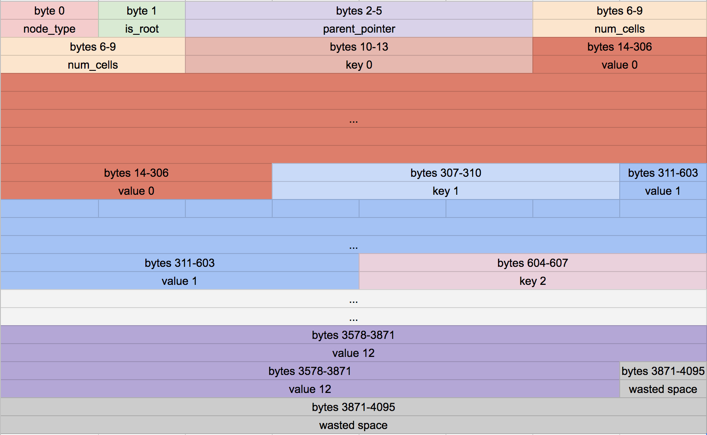

# Part3

我们要将我们的表结构从一个未排序的原始数据改为B-Tree。我们要在接下来的好多章节去实现这样一个相当大的改变。在Part3结束时，我们将实现定义叶子节点，并且支持插入 key/value 数据对到单一节点的树。在开始前，我们再次回顾下为什么我们要将数据结构换称为树形结构。

## Alternative Table Formats

Part2中的数据结构中，每个页面仅保存rows(没有元数据)，这使得空间利用相当的有效率。插入也是非常快的因为我们就是直接拼接到最后嘛。然而，为了找到给定的row只能通过遍历整个table。如果要删除一个row，我们只能通过挪动后面的所有数据都往前一格来填补那个洞。

如果我们保存数据时保证rows 被id排序，我们就能使用二分查找法找到某个id。然而插入会变慢，因为我们还是需要挪动很多rows解决空间问题。

除了上述方法，我们要用树形结构。树上每个节点都包含很多rows，我们在各个节点上记录相关信息，来清楚知道各自包含rows数量。而且我们还有Internal类型的节点来存储非rows数据的节点的数据。与如此庞大的数据文件交互，我们同时完成快速插入、删除和查询。

||**Unsorted Array of rows**|**Sorted Array of rows**|**Tree of nodes**|
|-|-|-|-|
|Pages contain|only data|only data|metadata, primary keys, and data|
|Rows per page|more|more|fewer|
|Insertion|O(1)|O(n)|O(log(n))|
|Deletion|O(n)|O(n)|O(log(n))|
|Lookup by id|O(n)|O(log(n))|O(log(n))|

## Node Header Format

首先定义一个NodeType:

`typedef enum { NODE_INTERNAL, NODE_LEAF } NodeType;`

每个节点对应一个页面。内部节点支持存储key(子节点最大值id)和页面pointer(子节点页面坐标index)。btree 向pager询问获得要操作、查询的页面坐标，然后获得回该页面的内存地址(void*)。页面数据在数据文件中是一个接一个排列存储的。

节点需要一些元数据，我们将这些元数据放到页面的开头。每个节点会存储对应的节点类型、是否是root节点、还有他的父节点pointer(父节点页面坐标index) - 作用是找到这个节点的兄弟节点。我为这些元数据字段申明了固定大小和偏移:

```c
// Common Node Header Layout
const uint32_t NODE_TYPE_SIZE = sizeof(uint8_t);
const uint32_t NODE_TYPE_OFFSET = 0;
const uint32_t IS_ROOT_SIZE = sizeof(uint8_t);
const uint32_t IS_ROOT_OFFSET = NODE_TYPE_SIZE;
const uint32_t PARENT_POINTER_SIZE = sizeof(uint32_t);
const uint32_t PARENT_POINTER_OFFSET = IS_ROOT_OFFSET + IS_ROOT_SIZE;
const uint8_t COMMON_NODE_HEADER_SIZE = NODE_TYPE_SIZE + IS_ROOT_SIZE + PARENT_POINTER_SIZE;

// Leaf Node Header Layout
const uint32_t LEAF_NODE_NUM_CELLS_SIZE = sizeof(uint32_t);
const uint32_t LEAF_NODE_NUM_CELLS_OFFSET = COMMON_NODE_HEADER_SIZE;
const uint32_t LEAF_NODE_HEADER_SIZE = COMMON_NODE_HEADER_SIZE + LEAF_NODE_NUM_CELLS_SIZE;

// Leaf Node Body Layout
const uint32_t LEAF_NODE_KEY_SIZE = sizeof(uint32_t);
const uint32_t LEAF_NODE_KEY_OFFSET = 0;
const uint32_t LEAF_NODE_VALUE_SIZE = ROW_SIZE;
const uint32_t LEAF_NODE_VALUE_OFFSET = LEAF_NODE_KEY_OFFSET + LEAF_NODE_KEY_SIZE;
const uint32_t LEAF_NODE_CELL_SIZE = LEAF_NODE_KEY_SIZE + LEAF_NODE_VALUE_SIZE;
const uint32_t LEAF_NODE_SPACE_FOR_CELLS = PAGE_SIZE - LEAF_NODE_HEADER_SIZE;
const uint32_t LEAF_NODE_MAX_CELLS = LEAF_NODE_SPACE_FOR_CELLS / LEAF_NODE_CELL_SIZE;

// 获得元素数据的方法
// 通过某个页面指针得知该页面有多少个cells
uint32_t* leaf_node_num_cells(void* node) {
  return node + LEAF_NODE_NUM_CELLS_OFFSET;
}
// 获取基于node指针的cell_num下偏移地址
void* leaf_node_cell(void* node, uint32_t cell_num) {
  return node + LEAF_NODE_HEADER_SIZE + cell_num * LEAF_NODE_CELL_SIZE;
}
// 获取基于node指针的cell_num偏移地址的KEY地址
uint32_t* leaf_node_key(void* node, uint32_t cell_num) {
  return leaf_node_cell(node, cell_num);
}
// 获取基于node指针的cell_num偏移地址的VALUE地址
uint32_t* leaf_node_key(void* node, uint32_t cell_num) {
  return leaf_node_cell(node, cell_num) + LEAF_NODE_VALUE_OFFSET;
}
// 初始化node之下的cell number个数为0
void initialize_leaf_node(void* node) { *leaf_node_num_cells(node) = 0; }
```

根据上面的定义，页面数据分布就像下图这样:



在每个页面头部放这些元数据在空间利用率下是有点低下的，但这使得我们让有效率的去拿到那些数据。

上面这些方法便于找到内存点，并且方便读/写.

## Changes to Pager and Table Objects

Pager、Table、Cursor对象变化

```c
typedef struct {
  int file_descriptor;
  uint32_t file_length;
+ uint32_t num_pages; // 记录总页面数
  void* pages[TABLE_MAX_PAGES];
} Pager;
typedef struct {
  Pager* pager;
- uint32_t num_rows;
+ uint32_t root_page_num; // 记录root 页面坐标
} Table;
typedef struct {
  Table* table;
- uint32_t row_num;
+ uint32_t page_num; // 记录page 坐标
+ uint32_t cell_num; // row_num 改为cell_num
  bool end_of_table;
} Cursor;
```

由于每个节点都要占据一整个页面，不管他是不是满的。所以我们要改造下写入到数据文件时的方案 - 整个页面直接写进去即可:

```c
-void pager_flush(Pager* pager, uint32_t page_num, uint32_t size) {
+void pager_flush(Pager* pager, uint32_t page_num) {
  ...
- ssize_t write_bytes = write(pager->file_descriptor, pager->pages[page_num], size);
+ ssize_t write_bytes = write(pager->file_descriptor, pager->pages[page_num]);
  ...

void db_close(Table* table) {
  Pager* pager = table->pager;
- uint32_t full_num_rows = table->row_nums / ROW_PER_PAGES;
- FORLESS(full_num_rows) {
+ FORLESS(pager->num_pages) {
    if (pager->pages[i] != NULL) {
-     pager_flush(pager, i, PAGE_SIZE);
+     pager_flush(pager, i);
      free(pager->pages[i]);
      pager->pages[i] = NULL;
    }
  }
  // 上面是整页写入的，就不需要补余下的
- uint32_t additional_num_rows = table->row_nums % ROW_PER_PAGES;
- if (additional_num_rows > 0) {
-   const page_num = full_num_rows;
-   if (pager->pages[page_num] != NULL) {
-     pager_flush(pager, page_num, additional_num_rows * ROW_SIZE);
-     free(pager->pages[page_num]);
-     pager->pages[page_num] = NULL;
-   }
- }
  ...
```

db_open 修改，当读取空数据库时，为内存数据写入num_cell个数为0:

```c
Table* db_open(const char* filename) {
  Pager* pager = pager_open(filename);
- uint32_t num_rows = pager->file_length / ROW_SIZE;

  Table* table = malloc(sizeof(Table));
  table->pager = pager;
- table->num_rows = num_rows;
+ table->row_page_num = 0;
+ if (pager->num_pages == 0) {
    // 当读取空数据库时，为内存数据写入num_cell个数为0
+   void* root_node = get_page(pager, 0);
+   initialize_leaf_node(root_node);
+ }
  return table;
}
```

为了知道页面数量，pager_open 时要获得；获取指定页面大于当前页面数量时，+1:

```c
Pager* pager_open(const char* filename) {
  ...
  Pager* pager = malloc(sizeof(Pager));
  pager->file_descriptor = fd;
  pager->file_length = read_bytes;
+ pager->num_pages = (read_bytes / PAGE_SIZE);

  // 页面存储都是整页，多余数据肯定非正确的
+ if (read_bytes % PAGE_SIZE != 0) {
+   printf("Db file is not a whole number of pages. Corrupt file.\n");
+   exit(EXIT_FAILURE);
+ }
  ...
}
void* get_page(Pager* pager, uint32_t page_num) {
  ...
    pager->pages[page_num] = page;
    // 当前页面总数 = 获取的页面坐标 + 1
+   if (page_num >= pager->num_pages) {
+     pager->num_pages = page_num + 1;
+   }
  }
  return pager->pages[page_num];
}
```

## Changes to the Cursor Object

table_start / table_end / cursor_advance 方法记录更换:

```c
Cursor* table_start(Table* table) {
  Cursor* cursor = malloc(sizeof(Cursor));
  cursor->table = table;
- cursor->row_num = 0;
- cursor->end_of_table = table->num_rows == 0;
+ cursor->page_num = table->root_page_num; // 当前直接写table->root_page_num, 之后会更改
+ cursor->cell_num = 0;
+
+ void* root_node = get_page(table->pager, table->root_page_num);
+ uint32_t num_cells = *leaf_node_num_cells(root_node);
+ cursor->end_of_table = (num_cells == 0);

  return cursor;
}
Cursor* table_end(Table* table) {
  Cursor* cursor = malloc(sizeof(Cursor));
  cursor->table = table;
- cursor->row_num = table->num_rows;
+ cursor->page_num = table->root_page_num; // 当前直接写table->root_page_num, 之后会更改
+
+ void* root_node = get_page(table->pager, table->root_page_num);
+ uint32_t num_cells = *leaf_node_num_cells(root_node);
+ cursor->cell_num = num_cells; // 个数都从pager的内存数据中获取
+ cursor->end_of_table = true; // table_end 方法end_of_table 就是 true

  return cursor;
}
void cursor_advance(Cursor* cursor) {
- cursor->row_num += 1;
- if (cursor->row_num == cursor->table->row_nums) {
+ uint32_t page_num = cursor->page_num;
+ void* node = get_page(cursor->table->pager, page_num);
+
  // cell数量 >= 存储数量必然是end_of_table
+ cursor->cell_num += 1;
+ if (cursor->cell_num >= (*leaf_node_num_cells(node))) {
    cursor->end_of_table = true;
  }
}
```

以上完成了准备阶段，还差一点点完成叶子节点的数据插入。

## Insertion Into a LeafNode

这篇文章仅实现单个节点的树(相对之前插入数据量退化，当前仅能插入13个元素，但知识暂时的)。

修改execute_insert，1. 仅能插入 LEAF_NODE_MAX_CELLS; 2. serialize_row直接写入改为新方法 - void(*leaf_node_insert)(Cursor*, uint32_t, Row*):

```c
ExecuteResult execute_insert(Statement* statement, Table* table) {
+ void* node = get_page(table->pager, table->root_page_num);
+ if ((*leaf_node_num_cells(node) >= LEAF_NODE_MAX_CELLS)) {
+   return EXECUTE_TABLE_FULL;
+ }
  Row* row_to_insert = &statement->row_to_insert;
  Cursor* cursor = table_end(table);
- void* page = cursor_value(cursor);
- serialize_row(page, row_to_insert);
- table->row_nums++;
+ leaf_node_insert(cursor, row_to_insert->id, row_to_insert);

  free(cursor);
  return EXECUTE_SUCCESS;
}
+void leaf_node_insert(Cursor* cursor, uint32_t key, Row* value) {
+ void* node = get_page(cursor->table->pager, cursor->page_num);

+ uint32_t num_cells = *leaf_node_num_cells(node);
+ if (num_cells >= LEAF_NODE_MAX_CELLS) {
+   printf("Need to implement splitting a leaf node.\n");
+   exit(EXIT_FAILURE);
+ }
  // 当总数为10，准备写入2，则需要内存挪移，> 2 的内存都向外挪动一个元素大小。为置放2腾出空间
+ if (cursor->cell_num < num_cells) {
+   for (uint32_t i = num_cells; i > cursor->cell_num; i--) {
+     memcpy(leaf_node_cell(node, i), leaf_node_cell(node, i - 1), LEAF_NODE_CELL_SIZE);
+   }
+ }
  // 内存中总数+1
+ *(leaf_node_num_cells(node)) += 1;
  // 内存key偏移位置写入key
+ *(leaf_node_key(node, cursor->cell_num)) = key;
  // 内存value偏移位置写入value
+ serialize_row(leaf_node_value(node, cursor->cell_num), value);
}
```

## Command to Print

补充下打印方便函数:

```c
+void print_constants() {
+ printf("ROW_SIZE: %d\n", ROW_SIZE);
+ printf("COMMON_NODE_HEADER_SIZE: %d\n", COMMON_NODE_HEADER_SIZE);
+ printf("LEAF_NODE_HEADER_SIZE: %d\n", LEAF_NODE_HEADER_SIZE);
+ printf("LEAF_NODE_CELL_SIZE: %d\n", LEAF_NODE_CELL_SIZE);
+ printf("LEAF_NODE_SPACE_FOR_CELLS: %d\n", LEAF_NODE_SPACE_FOR_CELLS);
+ printf("LEAF_NODE_MAX_CELLS: %d\n", LEAF_NODE_MAX_CELLS);
+}
+void print_leaf_node(void* node) {
+ uint32_t num_cells = *leaf_node_num_cells(node);
+ printf("leaf (size %d)\n", num_cells);
+ FORLESS(num_cells) {
+   uint32_t key = *leaf_node_key(node, i);
+   printf("  - %d : %d\n", i, key);
+ }
+}
MetaCommandResult do_meta_command(InputBuffer* input_buffer, Table* table) {
  // 模拟退出时保存数据
  if (strcmp(input_buffer->buffer, ".exit") == 0) {
    db_close(table);
    exit(EXIT_SUCCESS);
+ } else if (strcmp(input_buffer->buffer, ".btree") == 0) {
+   printf("Tree:\n");
+   print_leaf_node(get_page(table->pager, 0));
+   return META_COMMAND_SUCCESS;
+ } else if (strcmp(input_buffer->buffer, ".constants") == 0) {
+   printf("Constants:\n");
+   print_constants();
+   return META_COMMAND_SUCCESS;
+ }
  return META_COMMAND_UNRECOGNIZED;
}
```

## 测试

    $./part3 aa.db
    $> .constants
    $> insert 3 3 3 // Executed.
    $> insert 1 1 1 // Executed.
    $> insert 2 2 2 // Executed.
    $> .btree // Tree:
              // leaf (size 3)
              // -- 0 : 3
              // -- 1 : 1
              // -- 2 : 2

可以看到插入的数据还没有排序，待接下来继续优化。